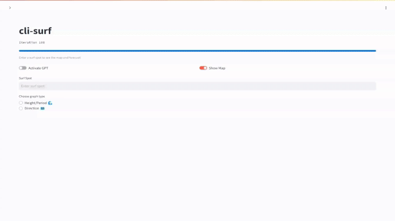

[](https://codecov.io/github/ryansurf/cli-surf)


<p align="center">
  
</p>


Surfs up!

cli-surf is a real time ocean data and forecasting service used in the command line.

Inspired by [wttr.in](https://github.com/chubin/wttr.in)

[Documentation](https://ryansurf.github.io/cli-surf/) | [Discord](https://discord.gg/He2UpxRuJP)

## 💻 Usage

Using your browser or command-line interface you can access the service.

```
$ curl localhost:8000

Location:  San Diego

      .-``'.
    .`   .`
_.-'     '._ 
        
UV index:  6.4
Wave Height:  3.9
Wave Direction:  238.0
Wave Period:  9.8

```

<p align="center">
    
</p>


**Arguments**
| Argument    | Description|
| -------- | ------- |
| location / loc  | Specify the location of your forecast. Ex: `location=new_york_city` **or** `location=nyc`.    |
| forecast / fc  | Number of forecast days. Max = 7, default = 0  |
| hide_wave / hw | Hide the default wave art    |
| show_large_wave / slw   | Show the large wave art   | 
| show_air_temp / sat   | Show the air temp   | 
| show_wind_speed / sws   | Show the wind speed   | 
| show_wind_direction / swd   | Show the wind direction   | 
| show_rain_sum / srs   | Show the rain sum   |
| show_precipitation_prob / spp   | Show the max precipitation chance   |
| hide_uv / huv    | Hide uv index   | 
| hide_height / hh    | Hide surf height   | 
| hide_direction / hdir    | Hide Swell direction    | 
| hide_period / hp  | Hide swell period    | 
| hide_location / hl    | Hide location   | 
| hide_date / hdate  | Hide date in forecast   | 
| metric / m  | Numbers in Metric units. Defaults to Imperial   | 
| decimal / dec   | Specify decimal points in output   | 
| color / c   | Choose color of wave art. Ex: `color=light_blue`   | 
| json / j   | Output the data in JSON format. Must be the only argument  | 
| gpt / g   | Activates the GPT surf report. Change the `GPT_PROMPT` variable in `.env` to customize responses. Default = off  |
| show_cloud_cover / scc   | Show the hourly cloud cover   |
| show_visibility / sv   | Show the hourly visibility   |
 
**Examples**
* Arguments are seperated by commas.
* `curl localhost:8000`
* `curl localhost:8000?location=new_york,hide_height,hide_wave,show_large_wave`
* `curl localhost:8000?fc=3,hdate,loc=trestles`

**For detailed information you can access the [help](https://github.com/ryansurf/cli-surf/blob/main/help.txt) page**

* `curl localhost:8000/help`


## 🛠️ Setup
### How to Start Locally with `Poetry`
To use cli-surf, clone the project locally and install the necessary dependencies via `poetry`.

1. Install [Poetry](https://python-poetry.org/docs/#installation).

2. Clone the repository.
    ```bash
    git clone https://github.com/ryansurf/cli-surf.git
    cd cli-surf
    ```

3. Install dependencies and Activate the virtual environment.
    ```bash
    make install
    ```

4. Run the project. For example, if the entry point is `server.py`, use the following command.
    ```bash
    python src/server.py

    # Alternatively, you can run the project using `Makefile`
    make run
    ```

### How to Start with `Docker`
If you do not have Poetry installed or do not want to pollute your local environment, you can also start the project using Docker Compose.

1. Install [Docker](https://docs.docker.com/engine/install/).
2. Install [Docker Compose](https://docs.docker.com/compose/install/).

3. Clone the repository.
    ```bash
    git clone https://github.com/ryansurf/cli-surf.git
    cd cli-surf
    ```

4. Docker compose up.
    ```bash
    docker compose up -d

    # Alternatively, you can run the project using `Makefile`
    make run_docker
    ```


### Variables

When running locally with Poetry, create a `.env` file from the `.env.example` file.
```bash
cp .env.example .env
```

Note that when starting with Docker, the `.env` file will be automatically created from `.env.example` during the image build.


| Variable    | Description|
| -------- | ------- | 
| `PORT`  | The port you want to open to run the application. Default = `8000` |
| `IP_ADDRESS`  | The ip your server is running on. Default = `localhost` |
| `SMTP_SERVER`  | The email server you are using. Default = smtp.gmail.com |
| `SMTP_PORT`  | The email server port you are using. Default = `587` |
| `EMAIL`  | The email you will send the report from. |
| `EMAIL_PW`  | The sending email's password |
| `EMAIL_RECEIVER`  | The email that will receive the report (your personal email) |
| `COMMAND`  | The command that will be ran and shown in the email. Default = `localhost:8000` |
| `SUBJECT`  | The email's subject. Default = Surf Report |
| `GPT_PROMPT`  | Given the surf data (height, swell direction, etc.), you can tell the GPT what kind of report you would like. For example: `With this data, recommend what size board I should ride and nearby surf spots that may be better with the given conditions.` |
| `API_KEY`  | Your OpenAI API key. Optional, the default GPT does not need an API key (and has slighly worse performance). Create one [here](https://platform.openai.com/api-keys) |
| `GPT_MODEL`  | The OpenAI GPT model. Default = `gpt-3.5-turbo` (if possible, using `gpt-4o` is recommended.) Explore other models [here](https://platform.openai.com/docs/overview)|


### Email Server

Optional, sends a surf report to a specified email.

You will need to setup an email account that is able to utilize SMTP services. Gmail can be used, following Method #1 outlined [here](https://www.cubebackup.com/blog/how-to-use-google-smtp-service-to-send-emails-for-free/). After doing this, change the variables in `.env`

The Email Server can be executed using one of the following methods.
```bash
# Send Email locally using Poetry
make send_email

# Send Email in a Docker container
make send_email_docker
```
Note that the Flask server must be running in order to send emails.

### Frontend

<p align="center">
    
</p>

Although this application was made with the cli in mind, there is a frontend.

**Streamlit Frontend**

[Streamlit](https://streamlit.io/) is used! 

To run streamlit: `streamlit run src/dev_streamlit.py`

You will be able to find the frontend here: `http://localhost:8502`

**HTML/JS/CSS Frontend**

> [!NOTE]
> Streamlit is now the main focus for the frontend. This legacy frontend is no longer being actively developed.

`http://localhost:8000/home` **or** `<ip_of_host>:<port>/home` if the application is running on a different host or you have changed the default port.

You may need to change `IP_ADDRESS` in `.env` to match the ip of the host running the machine.

Now, running `python3 server.py` will launch the website!


### 🧠 GPT Surf Report

**cli-surf** can generate personalized surf reports using OpenAI's GPT models. This section is for those that choose to not rely on gpt4free as the repo faces pending legal action.

**Enabling GPT Reports**

1. **Obtain an OpenAI API Key**:

   - Sign up at [OpenAI](https://beta.openai.com/signup/).
   - Navigate to the API section and create a new API key.
   - Make sure to add a payment method.

2. **Update `.env` File**:

   ```bash
   GPT_PROMPT=With this data, recommend what size board I should ride and nearby surf spots that may be better with the given conditions.
   API_KEY=your_openai_api_key_here
   GPT_MODEL=gpt-3.5-turbo  # Or use gpt-4 for better results
   ```

3. **Use the GPT Argument:**:
    - Example Usage:
  ```bash
  curl localhost:8000?location=Malibu,gpt
  ```

**Customizing the GPT Prompt**
You can tailor the response by changing the GPT_PROMPT in your .env file to get different types of reports.

   - Common Examples:
      ```bash
        GPT_PROMPT="Analyze the surf conditions and suggest the best time of day to surf."
       ```
       ```bash
        GPT_PROMPT="What are some good places to eat around this surf spot"
       ```

**Notes on Usage**
  - Common Issue: Without a payment method, this feature will not work as OpenAI will deny API requests from these accounts.
  - API Costs: Using the GPT feature will consume tokens from your OpenAI account based on the size of your custom prompt and the responses.
  - Response Time: Generating GPT responses may take longer than standard outputs, especially if there are outages.
  - Model Selection: Using gpt-4 provides better results but may be slower and more expensive than gpt-3.5-turbo.


## 📈 Contributing

Thank you for considering contributing to cli-surf!

See [CONTRIBUTING.md](https://github.com/ryansurf/cli-surf/blob/main/CONTRIBUTING.md) to get an idea of how contributions work.

Questions? Comments?

* [Discord](https://discord.gg/He2UpxRuJP)
* [Discussions](https://github.com/ryansurf/cli-surf/discussions)
* [GitHub](https://github.com/ryansurf)

## ✨ Contributors

[](#contributors)

<!-- ALL-CONTRIBUTORS-LIST:START - Do not remove or modify this section -->
<!-- prettier-ignore-start -->
<!-- markdownlint-disable -->
<table>
  <tbody>
    <tr>
      <td align="center" valign="top" width="14.28%"><a href="https://ryansurf.github.io/"><br /><sub><b>Ryan Frederich</b></sub></a><br /><a href="#code-ryansurf" title="Code">💻</a> <a href="#doc-ryansurf" title="Documentation">📖</a> <a href="#test-ryansurf" title="Tests">⚠️</a> <a href="#ideas-ryansurf" title="Ideas, Planning, & Feedback">🤔</a> <a href="#question-ryansurf" title="Answering Questions">💬</a></td>
      <td align="center" valign="top" width="14.28%"><a href="https://github.com/K-dash"><br /><sub><b>𝕂' </b></sub></a><br /><a href="#code-K-dash" title="Code">💻</a> <a href="#doc-K-dash" title="Documentation">📖</a> <a href="#test-K-dash" title="Tests">⚠️</a> <a href="#ideas-K-dash" title="Ideas, Planning, & Feedback">🤔</a> <a href="#question-K-dash" title="Answering Questions">💬</a></td>
      <td align="center" valign="top" width="14.28%"><a href="https://github.com/death12239"><br /><sub><b>Corey L.</b></sub></a><br /><a href="#code-death12239" title="Code">💻</a></td>
      <td align="center" valign="top" width="14.28%"><a href="https://github.com/shaifulazh"><br /><sub><b>Shaiful Azhar</b></sub></a><br /><a href="#code-shaifulazh" title="Code">💻</a></td>
      <td align="center" valign="top" width="14.28%"><a href="https://github.com/Hummus-Ful"><br /><sub><b>Hummus-Ful</b></sub></a><br /><a href="#infra-Hummus-Ful" title="Infrastructure (Hosting, Build-Tools, etc)">🚇</a></td>
      <td align="center" valign="top" width="14.28%"><a href="https://github.com/Rajiv-Rago"><br /><sub><b>Rajiv-Rago</b></sub></a><br /><a href="#code-Rajiv-Rago" title="Code">💻</a></td>
      <td align="center" valign="top" width="14.28%"><a href="https://github.com/Ulises-Sanch3z"><br /><sub><b>Ulises-Sanch3z</b></sub></a><br /><a href="#code-Ulises-Sanch3z" title="Code">💻</a></td>
    </tr>
    <tr>
      <td align="center" valign="top" width="14.28%"><a href="https://github.com/avkoll"><br /><sub><b>Andrew Koller</b></sub></a><br /><a href="#code-avkoll" title="Code">💻</a></td>
      <td align="center" valign="top" width="14.28%"><a href="https://github.com/mrmcgrain"><br /><sub><b>Michael McGrain</b></sub></a><br /><a href="#code-mrmcgrain" title="Code">💻</a></td>
      <td align="center" valign="top" width="14.28%"><a href="https://github.com/SeanAverS"><br /><sub><b>SeanAverS</b></sub></a><br /><a href="#code-SeanAverS" title="Code">💻</a></td>
      <td align="center" valign="top" width="14.28%"><a href="https://github.com/rabelmervin"><br /><sub><b>Rabel Mervin </b></sub></a><br /><a href="#code-rabelmervin" title="Code">💻</a></td>
      <td align="center" valign="top" width="14.28%"><a href="https://github.com/vaibhav-2703"><br /><sub><b>Vaibhav Chouhan</b></sub></a><br /><a href="#code-vaibhav-2703" title="Code">💻</a></td>
      <td align="center" valign="top" width="14.28%"><a href="https://github.com/NandaniThakur"><br /><sub><b>Nandani Thakur </b></sub></a><br /><a href="#code-NandaniThakur" title="Code">💻</a></td>
      <td align="center" valign="top" width="14.28%"><a href="https://github.com/hotpocket"><br /><sub><b>Brandon</b></sub></a><br /><a href="#infra-hotpocket" title="Infrastructure (Hosting, Build-Tools, etc)">🚇</a></td>
    </tr>
    <tr>
      <td align="center" valign="top" width="14.28%"><a href="https://github.com/ChristianToro"><br /><sub><b>ChristianToro</b></sub></a><br /><a href="#code-ChristianToro" title="Code">💻</a> <a href="#bug-ChristianToro" title="Bug reports">🐛</a></td>
      <td align="center" valign="top" width="14.28%"><a href="https://github.com/MylesPerHour201"><br /><sub><b>Myles B.</b></sub></a><br /><a href="#code-MylesPerHour201" title="Code">💻</a></td>
      <td align="center" valign="top" width="14.28%"><a href="https://github.com/balugans"><br /><sub><b>Balaji Ganapathy</b></sub></a><br /><a href="#bug-balugans" title="Bug reports">🐛</a></td>
      <td align="center" valign="top" width="14.28%"><a href="https://github.com/chengjackjelly"><br /><sub><b>chengjackjelly</b></sub></a><br /><a href="#infra-chengjackjelly" title="Infrastructure (Hosting, Build-Tools, etc)">🚇</a></td>
      <td align="center" valign="top" width="14.28%"><a href="https://github.com/vsingk"><br /><sub><b>Varun Singh</b></sub></a><br /><a href="#doc-vsingk" title="Documentation">📖</a></td>
      <td align="center" valign="top" width="14.28%"><a href="https://github.com/macnult"><br /><sub><b>macnult</b></sub></a><br /><a href="#code-macnult" title="Code">💻</a></td>
      <td align="center" valign="top" width="14.28%"><a href="https://github.com/AITMAR-TAFE"><br /><sub><b>AITMAR-TAFE</b></sub></a><br /><a href="#code-AITMAR-TAFE" title="Code">💻</a></td>
    </tr>
  </tbody>
</table>

<!-- markdownlint-restore -->
<!-- prettier-ignore-end -->

<!-- ALL-CONTRIBUTORS-LIST:END -->


## License
[](https://badges.mit-license.org)
