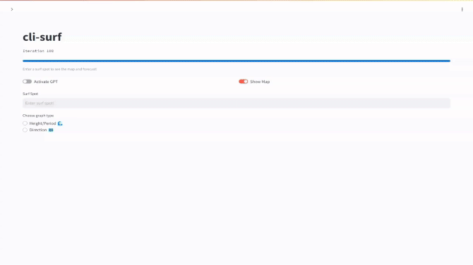

[](https://codecov.io/github/ryansurf/cli-surf)


<p align="center">
  
</p>

**cli-surf** is a real-time ocean data and surf forecasting tool for the command line.

- Live wave height, swell direction, period, UV index, wind, and more
- Real-time tide level with direction indicator and next tide extreme (via NOAA)
- Sea surface temperature
- Forecasts up to 7 days out
- Use as a CLI tool (`surf`) or query via HTTP API / browser
- Optional GPT-powered surf reports (includes tide and sea temp context)
- Supports metric and imperial units, custom colors, and JSON output

Inspired by [wttr.in](https://github.com/chubin/wttr.in) · [Documentation](https://ryansurf.github.io/cli-surf/) · [Discord](https://discord.gg/He2UpxRuJP)

<p align="center">
    
</p>

---

## Table of Contents

- [Usage](#-usage)
- [Setup](#️-setup)
  - [Poetry](#how-to-start-locally-with-poetry)
  - [Docker](#how-to-start-with-docker)
  - [Environment Variables](#variables)
  - [Email Server](#email-server)
  - [MongoDB](#mongodb)
- [GPT Surf Report](#-gpt-surf-report)
- [Tech Stack](#-tech-stack)
- [Architecture](#-architecture)
- [Contributing](#-contributing)
- [Contributors](#-contributors)

---

## 💻 Usage

There are several ways to use cli-surf: install it as a CLI tool via pipx, hit the public API, or run the server locally and access it via API/browser.

### Installing via [pipx](https://pipx.pypa.io/stable/) ([pypi](https://pypi.org/project/cli-surf/))

```bash
brew install pipx
pipx install cli-surf
```

```bash
surf --help
surf --location scripps_pier --forecast 4
```

### Hitting the public API

```
curl https://api.clisurf.com
```

### Running the server locally and using via API

Start the server locally (see [Setup](#️-setup) below), then query it from your browser or CLI:

```
$ curl localhost:8000

Location:  San Diego

      .-``'.
    .`   .`
_.-'     '._

UV index:  6.4
Wave Height:  3.9
Wave Direction:  238.0
Wave Period:  9.8
Sea Surface Temp: 64.8
Tide: 3.2 ft ↑ | Next High: 5.1 ft @ 14:30 UTC

```

**API Examples**
> Arguments are separated by commas.

```bash
curl localhost:8000
curl localhost:8000?location=new_york,hide_height,hide_wave,show_large_wave
curl localhost:8000?fc=3,hdate,loc=trestles,c=light_blue
curl localhost:8000?show_past_uv,show_height_history,show_direction_history,show_period_history
curl localhost:8000?loc=malibu,gpt,color=yellow
curl localhost:8000?loc=nazare,json
```

For the full argument reference, see below or run:
```bash
curl localhost:8000/help
```

**API Arguments**

*Display*

| Argument | Shorthand | Description |
|---|---|---|
| `location` | `loc` | Location for the forecast. Ex: `loc=new_york_city` or `loc=nyc` |
| `hide_wave` | `hw` | Hide the default wave art |
| `show_large_wave` | `slw` | Show the large wave art |
| `color` | `c` | Color of wave art. Ex: `color=light_blue` |
| `hide_location` | `hl` | Hide location name |
| `hide_date` | `hdate` | Hide date in forecast |
| `metric` | `m` | Use metric units (default: imperial) |
| `decimal` | `dec` | Specify decimal places in output |
| `json` | `j` | Output data as JSON. Must be the only argument |

*Surf Conditions*

| Argument | Shorthand | Description |
|---|---|---|
| `hide_height` | `hh` | Hide wave height |
| `hide_direction` | `hdir` | Hide swell direction |
| `hide_period` | `hp` | Hide swell period |
| `hide_uv` | `huv` | Hide UV index |
| `hide_tide` | `ht` | Hide tide level and next extreme (shown by default, requires US coastal location) |
| `show_air_temp` | `sat` | Show air temperature |
| `show_wind_speed` | `sws` | Show wind speed |
| `show_wind_direction` | `swd` | Show wind direction |
| `show_rain_sum` | `srs` | Show rain sum |
| `show_precipitation_prob` | `spp` | Show max precipitation chance |
| `show_cloud_cover` | `scc` | Show hourly cloud cover |
| `show_visibility` | `sv` | Show hourly visibility |

*Historical Data*

| Argument | Shorthand | Description |
|---|---|---|
| `show_past_uv` | `spuv` | Show past UV index |
| `hide_past_uv` | — | Hide past UV index |
| `show_height_history` | `shh` | Show past wave height |
| `hide_height_history` | — | Hide past wave height |
| `show_direction_history` | `sdh` | Show past wave direction |
| `hide_direction_history` | — | Hide past wave direction |
| `show_period_history` | `sph` | Show past wave period |
| `hide_period_history` | — | Hide past wave period |

*GPT*

| Argument | Shorthand | Description |
|---|---|---|
| `gpt` | `g` | Activate GPT surf report. Customize via `GPT_PROMPT` in `.env`. Default: off |

---

## 🛠️ Setup

### How to Start Locally with `Poetry`

1. Install [Poetry](https://python-poetry.org/docs/#installation).

2. Clone the repository.
    ```bash
    git clone https://github.com/ryansurf/cli-surf.git
    cd cli-surf
    ```

3. Install dependencies and activate the virtual environment.
    ```bash
    make install
    ```

4. Start the server.
    ```bash
    poetry run python src/server.py

    # Or via Makefile
    make run
    ```

### How to Start with `Docker`

1. Install [Docker](https://docs.docker.com/engine/install/) and [Docker Compose](https://docs.docker.com/compose/install/).

2. Clone the repository.
    ```bash
    git clone https://github.com/ryansurf/cli-surf.git
    cd cli-surf
    ```

3. Start the container.
    ```bash
    docker compose up -d

    # Or via Makefile
    make run_docker
    ```

### Variables

When running locally with Poetry, create a `.env` file from the example:
```bash
cp .env.example .env
```

When starting with Docker, the `.env` file is created automatically from `.env.example` during the image build.

**General**

| Variable | Description |
|---|---|
| `PORT` | Port to run the application on. Default: `8000` |
| `IP_ADDRESS` | IP address the server runs on. Default: `localhost` |

**Email** *(optional — see [Email Server](#email-server))*

| Variable | Description |
|---|---|
| `SMTP_SERVER` | Email server. Default: `smtp.gmail.com` |
| `SMTP_PORT` | Email server port. Default: `587` |
| `EMAIL` | Address to send the report from |
| `EMAIL_PW` | Sending email's password |
| `EMAIL_RECEIVER` | Address to receive the report |
| `COMMAND` | Command shown in the email. Default: `localhost:8000` |
| `SUBJECT` | Email subject line. Default: `Surf Report` |

**GPT** *(optional — see [GPT Surf Report](#-gpt-surf-report))*

| Variable | Description |
|---|---|
| `GPT_PROMPT` | Prompt sent to the model along with surf data. Ex: `With this data, recommend what size board I should ride.` |
| `API_KEY` | OpenAI API key. Create one [here](https://platform.openai.com/api-keys) |
| `GPT_MODEL` | OpenAI model to use. Default: `gpt-3.5-turbo` (recommended: `gpt-4o`). See all models [here](https://platform.openai.com/docs/overview) |

**Database** *(optional — see [MongoDB](#mongodb))*

| Variable | Description |
|---|---|
| `DB_URI` | MongoDB connection URI |

### Email Server

Optional — sends a surf report to a specified email on a schedule.

You'll need an email account with SMTP access. Gmail works; follow Method #1 [here](https://www.cubebackup.com/blog/how-to-use-google-smtp-service-to-send-emails-for-free/), then update the email variables in `.env`.

> Note: The FastAPI server must be running to send emails.

```bash
# Send email locally (Poetry)
make send_email

# Send email via Docker
make send_email_docker
```

### MongoDB

Optional — stores all request output in a MongoDB database.

See the [MongoDB get started guide](https://www.mongodb.com/docs/get-started/?language=python) for setup, then set `DB_URI` in your `.env`.

### Frontend

<details>
<summary>Note: The frontend is no longer maintained</summary>

<p align="center">
    
</p>

Although this application was made with the CLI in mind, a frontend exists.

**Streamlit Frontend**

```bash
streamlit run src/dev_streamlit.py
# Available at http://localhost:8502
```

**HTML/JS/CSS Frontend** *(legacy, no longer actively developed)*

Available at `http://localhost:8000/home` or `<ip_of_host>:<port>/home`.

You may need to set `IP_ADDRESS` in `.env` to match the host's IP.

</details>

---

## 🧠 GPT Surf Report

cli-surf can generate personalized surf reports using OpenAI's GPT models.

**Setup**

1. Get an OpenAI API key at [platform.openai.com](https://platform.openai.com/api-keys). Make sure a payment method is added.

2. Update `.env`:
   ```bash
   API_KEY=your_openai_api_key_here
   GPT_MODEL=gpt-3.5-turbo   # gpt-4o recommended for better results
   GPT_PROMPT=With this data, recommend what size board I should ride and nearby surf spots that may be better with the given conditions.
   ```

3. Use the `gpt` argument:
   ```bash
   curl localhost:8000?location=Malibu,gpt
   ```

**Customizing the prompt**

Change `GPT_PROMPT` in `.env` to get different types of reports:
```bash
GPT_PROMPT="Analyze the surf conditions and suggest the best time of day to surf."
GPT_PROMPT="What are some good places to eat around this surf spot?"
```

**Notes**
- A payment method is required — OpenAI will reject requests from free accounts.
- GPT responses consume tokens based on prompt and response size.
- Response time may be slower than standard output, especially during OpenAI outages.
- `gpt-4o` gives better results than `gpt-3.5-turbo` but costs more.

---

## 🔧 Tech Stack

| Layer | Technology |
|---|---|
| Language | Python 3.10+ |
| Web framework | FastAPI + Uvicorn |
| CLI | Click |
| Weather data | [Open-Meteo API](https://open-meteo.com/) |
| Optional AI | OpenAI GPT API |
| Optional database | MongoDB (pymongo) |
| Optional frontend | Streamlit |
| Packaging | Poetry, pipx |
| Containerization | Docker / Docker Compose |
| Cloud | AWS (Lambda, ECR, API Gateway), CloudFlare (DNS resolver), GoDaddy (register domain name) |

---

## 📐 Architecture

[Architecture](docs/architecture.png)

## 📈 Contributing

Thank you for considering contributing to cli-surf!

See [CONTRIBUTING.md](https://github.com/ryansurf/cli-surf/blob/main/CONTRIBUTING.md) to get started.

Questions? Comments?

* [Discord](https://discord.gg/He2UpxRuJP)
* [Discussions](https://github.com/ryansurf/cli-surf/discussions)
* [GitHub](https://github.com/ryansurf)

---

## ✨ Contributors

[](#contributors)

<!-- ALL-CONTRIBUTORS-LIST:START - Do not remove or modify this section -->
<!-- prettier-ignore-start -->
<!-- markdownlint-disable -->
<table>
  <tbody>
    <tr>
      <td align="center" valign="top" width="14.28%"><a href="https://ryansurf.github.io/"><br /><sub><b>Ryan Frederich</b></sub></a><br /><a href="#code-ryansurf" title="Code">💻</a> <a href="#doc-ryansurf" title="Documentation">📖</a> <a href="#test-ryansurf" title="Tests">⚠️</a> <a href="#ideas-ryansurf" title="Ideas, Planning, & Feedback">🤔</a> <a href="#question-ryansurf" title="Answering Questions">💬</a></td>
      <td align="center" valign="top" width="14.28%"><a href="https://github.com/K-dash"><br /><sub><b>𝕂' </b></sub></a><br /><a href="#code-K-dash" title="Code">💻</a> <a href="#doc-K-dash" title="Documentation">📖</a> <a href="#test-K-dash" title="Tests">⚠️</a> <a href="#ideas-K-dash" title="Ideas, Planning, & Feedback">🤔</a> <a href="#question-K-dash" title="Answering Questions">💬</a></td>
      <td align="center" valign="top" width="14.28%"><a href="https://github.com/death12239"><br /><sub><b>Corey L.</b></sub></a><br /><a href="#code-death12239" title="Code">💻</a></td>
      <td align="center" valign="top" width="14.28%"><a href="https://github.com/shaifulazh"><br /><sub><b>Shaiful Azhar</b></sub></a><br /><a href="#code-shaifulazh" title="Code">💻</a></td>
      <td align="center" valign="top" width="14.28%"><a href="https://github.com/Hummus-Ful"><br /><sub><b>Hummus-Ful</b></sub></a><br /><a href="#infra-Hummus-Ful" title="Infrastructure (Hosting, Build-Tools, etc)">🚇</a></td>
      <td align="center" valign="top" width="14.28%"><a href="https://github.com/Rajiv-Rago"><br /><sub><b>Rajiv-Rago</b></sub></a><br /><a href="#code-Rajiv-Rago" title="Code">💻</a></td>
      <td align="center" valign="top" width="14.28%"><a href="https://github.com/Ulises-Sanch3z"><br /><sub><b>Ulises-Sanch3z</b></sub></a><br /><a href="#code-Ulises-Sanch3z" title="Code">💻</a></td>
    </tr>
    <tr>
      <td align="center" valign="top" width="14.28%"><a href="https://github.com/avkoll"><br /><sub><b>Andrew Koller</b></sub></a><br /><a href="#code-avkoll" title="Code">💻</a></td>
      <td align="center" valign="top" width="14.28%"><a href="https://github.com/mrmcgrain"><br /><sub><b>Michael McGrain</b></sub></a><br /><a href="#code-mrmcgrain" title="Code">💻</a></td>
      <td align="center" valign="top" width="14.28%"><a href="https://github.com/SeanAverS"><br /><sub><b>SeanAverS</b></sub></a><br /><a href="#code-SeanAverS" title="Code">💻</a></td>
      <td align="center" valign="top" width="14.28%"><a href="https://github.com/rabelmervin"><br /><sub><b>Rabel Mervin </b></sub></a><br /><a href="#code-rabelmervin" title="Code">💻</a></td>
      <td align="center" valign="top" width="14.28%"><a href="https://github.com/vaibhav-2703"><br /><sub><b>Vaibhav Chouhan</b></sub></a><br /><a href="#code-vaibhav-2703" title="Code">💻</a></td>
      <td align="center" valign="top" width="14.28%"><a href="https://github.com/NandaniThakur"><br /><sub><b>Nandani Thakur </b></sub></a><br /><a href="#code-NandaniThakur" title="Code">💻</a></td>
      <td align="center" valign="top" width="14.28%"><a href="https://github.com/hotpocket"><br /><sub><b>Brandon</b></sub></a><br /><a href="#infra-hotpocket" title="Infrastructure (Hosting, Build-Tools, etc)">🚇</a></td>
    </tr>
    <tr>
      <td align="center" valign="top" width="14.28%"><a href="https://github.com/ChristianToro"><br /><sub><b>ChristianToro</b></sub></a><br /><a href="#code-ChristianToro" title="Code">💻</a> <a href="#bug-ChristianToro" title="Bug reports">🐛</a></td>
      <td align="center" valign="top" width="14.28%"><a href="https://github.com/MylesPerHour201"><br /><sub><b>Myles B.</b></sub></a><br /><a href="#code-MylesPerHour201" title="Code">💻</a></td>
      <td align="center" valign="top" width="14.28%"><a href="https://github.com/balugans"><br /><sub><b>Balaji Ganapathy</b></sub></a><br /><a href="#bug-balugans" title="Bug reports">🐛</a></td>
      <td align="center" valign="top" width="14.28%"><a href="https://github.com/chengjackjelly"><br /><sub><b>chengjackjelly</b></sub></a><br /><a href="#infra-chengjackjelly" title="Infrastructure (Hosting, Build-Tools, etc)">🚇</a></td>
      <td align="center" valign="top" width="14.28%"><a href="https://github.com/vsingk"><br /><sub><b>Varun Singh</b></sub></a><br /><a href="#doc-vsingk" title="Documentation">📖</a> <a href="#bug-vsingk" title="Bug reports">🐛</a></td>
      <td align="center" valign="top" width="14.28%"><a href="https://github.com/macnult"><br /><sub><b>macnult</b></sub></a><br /><a href="#code-macnult" title="Code">💻</a></td>
      <td align="center" valign="top" width="14.28%"><a href="https://github.com/AITMAR-TAFE"><br /><sub><b>AITMAR-TAFE</b></sub></a><br /><a href="#code-AITMAR-TAFE" title="Code">💻</a></td>
    </tr>
    <tr>
      <td align="center" valign="top" width="14.28%"><a href="https://github.com/latiffetahaj"><br /><sub><b>Latif Fetahaj</b></sub></a><br /><a href="#code-latiffetahaj" title="Code">💻</a> <a href="#test-latiffetahaj" title="Tests">⚠️</a></td>
      <td align="center" valign="top" width="14.28%"><a href="http://www.kimcodes.lol"><br /><sub><b>Kim</b></sub></a><br /><a href="#test-kimmustcode" title="Tests">⚠️</a> <a href="#code-kimmustcode" title="Code">💻</a></td>
      <td align="center" valign="top" width="14.28%"><a href="https://github.com/hebentod"><br /><sub><b>Devon Hebenton</b></sub></a><br /><a href="#code-hebentod" title="Code">💻</a></td>
      <td align="center" valign="top" width="14.28%"><a href="https://github.com/AristosKass"><br /><sub><b>AristosKass</b></sub></a><br /><a href="#test-AristosKass" title="Tests">⚠️</a></td>
      <td align="center" valign="top" width="14.28%"><a href="https://github.com/raza-khan0108"><br /><sub><b>Raza Khan</b></sub></a><br /><a href="#code-raza-khan0108" title="Code">💻</a></td>
    </tr>
  </tbody>
</table>

<!-- markdownlint-restore -->
<!-- prettier-ignore-end -->

<!-- ALL-CONTRIBUTORS-LIST:END -->

## License
[](https://badges.mit-license.org)
